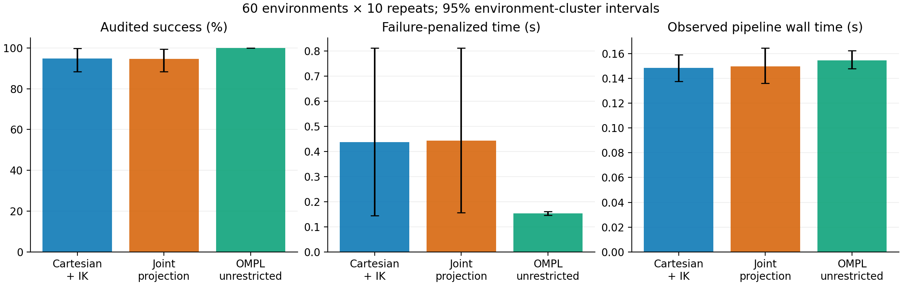

# Pure GMM sampler selection case study

**Recommendation: use `joint_projected` as the provisional path-quality choice for the EV benchmark.** Independent confirmation supports lower total joint travel. Neither custom method demonstrated superior success rate or failure-penalized planning time. The recommended choice is conditional on the current positional task constraints; tight tool-orientation requirements need separate validation.

Completed on 26 September 2026: **2,700 measured plans, 120 independently generated environments**, plus an excluded 18-plan smoke study and synthetic strict-fallback tests. All three repositories (`tp_gmm`, `moveit2`, `moveit_resources`) use `sampling-approaches-cod`. Planning was controller-free using MoveIt collision scenes; these were not robot-execution or EV-disassembly trials.

## Results

| Phase | Method | Audited successes | Successful median action time (s) | Median joint travel (rad) | Median EE path length (m) |
|---|---|---:|---:|---:|---:|
| primary | cartesian_ik | 569/600 | 0.1248 | 9.929 | 0.688 |
| primary | joint_projected | 568/600 | 0.1200 | 9.278 | 0.682 |
| primary | ompl_uniform | 600/600 | 0.1458 | 13.299 | 2.044 |
| confirmation | cartesian_ik | 284/300 | 0.1207 | 9.417 | 0.694 |
| confirmation | joint_projected | 282/300 | 0.1228 | 8.435 | 0.659 |
| confirmation | ompl_uniform | 300/300 | 0.1474 | 13.357 | 2.116 |

Joint travel is MoveIt’s distance-weighted sum of absolute joint changes along the path. It is not a Euclidean joint-vector norm, measured energy, or Cartesian distance. Path medians are conditioned on audited success; latency medians above likewise exclude failed plans.

The initial 1,800-plan study used 60 environments × 10 repeats × three methods. Cartesian IK achieved 94.83% audited success and projection 94.67%; the paired difference was **+0.17 percentage points**, with a 95% environment-cluster interval of **−0.33 to +0.67 pp**. Mean PAR2 was 0.4370 s versus 0.4432 s. Its paired difference was −0.0063 s (95% CI −0.0379 to +0.0243), with Holm p = 1.0. This does not support a speed/reliability superiority claim or the prespecified 10% runtime advantage.

Exploratory matched-success results suggested lower projected joint travel (Cartesian minus projected: 0.908 rad, 95% CI 0.408–1.437). We then fixed a separate confirmation protocol **before** generating its new plans: 60 new environments, five repeats and the same three configurations, with joint and EE path-length hypotheses forming a two-test directional Holm family. No further runs were added after confirmation.

| Independent confirmation: Cartesian minus projected | Effect | 95% cluster CI | One-sided Holm p |
|---|---:|---:|---:|
| joint_path_length | 0.80128 | [0.14651, 1.48097] | 0.04262 |
| ee_path_length_m | 0.02552 | [-0.01325, 0.06495] | 0.12206 |

The confirmation retained **281 matched successful pairs in 57 environments**. Joint-travel reduction was confirmed; EE path-length reduction was not. These are conditional-on-success effects, and excluding unmatched failures creates survivor selection. The confirmation’s success/PAR2 results were secondary and again did not establish superiority. The two studies’ p-values were not pooled.

*Pointwise 95% stratified environment-cluster intervals. PAR2 charges each failure 6 s; successful action time is capped at the 3 s planning budget. Observed pipeline wall time includes early failures and is not time-to-success. An all-success bootstrap interval at 100% does not prove perfect population reliability.*

## What caused the failures

In the initial study, three environments at requested normalized clearance 0.8 had start states outside the deformed corridor: 30 failures per custom method. Their requested start positions were inside the original GMM’s enclosing boxes, but outside the deformed boxes. This is a shared deformation/endpoint-compatibility limitation, not a sampler-specific failure. The confirmation encountered three more such environments, causing 15 failures per custom method.

Beyond these shared failures, Cartesian IK had one returned-path audit failure in each phase. Projection had one planning failure and one audit failure initially, then two planning failures and one audit failure in confirmation. Across both phases, dense auditing rejected one joint-bounds violation and three corridor violations; none of those four rejected paths had a sampled collision. They remain failures in every success table. The runner never relaxes the corridor or retries with uniform sampling.

Unrestricted OMPL succeeded on all 900 measured requests. Its larger feasible region avoids the GMM endpoint restriction, while its unsimplified RRTConnect paths were substantially longer in these experiments. The baseline comparison is between complete planning configurations with different feasible regions; it does not isolate proposal density alone. Baseline success superiority was not established by the small number of discordant environment clusters after the primary multiple-test correction.

## Interpretation and sampler tradeoffs

| Method | Observed advantage | Cost or limitation |
|---|---|---|
| Cartesian + IK | Exact truncated Cartesian proposal before IK/feasibility filtering; higher target acceptance in this study | Repeated online IK; random redundant IK solutions can increase joint travel; the accepted joint distribution is not Gaussian |
| Joint projection | Confirmed lower joint travel; very inexpensive online mapping; zero online IK rescue in measured runs | Per-request anchor IK/setup; local approximation, trust-region/support rejection and missing-anchor coverage limits; translational mapping does not preserve tool orientation |
| Unrestricted OMPL | All measured requests succeeded; no model or anchor preparation | Longer unsimplified paths here; no learned corridor guidance; default samples are uniform in joint coordinates, not Cartesian volume |

Initial median sampler setup was about 18 ms for projection, including anchor IK; its online sampling loop was about 0.1 ms per request. Cartesian IK’s online sampling loop was about 11 ms per request. These are aggregate per-request timers, not per-draw latency. Setup compensates for much of projection’s online saving. Median TP-GMM/RL preparation was about 16 ms per environment and was shared between the paired custom configurations. See the phase summaries for model load, reproduction, RL, regression, anchor IK, Jacobian and FK breakdowns. Nested timers must not be added together.

## Experimental controls and scope

- Identical robot, frozen full scene, exact joint endpoints, RRTConnect configuration and 3 s budget within each environment. One planning attempt; path simplification disabled; common time parameterization/validation adapters. Newly generated environments are not proven absent from the RL training distribution.
- Six balanced strata: central/offset/distant cylinder, each crossed with normalized clearance 0.2/0.8. Endpoint IK/collision infeasibility is rejected during environment generation; corridor-incompatible endpoints count as experimental failures.
- Both custom modes: `proposal=gmm`, covariance cutoff **2.0**, `uniform_fraction=0`, `cartesian_fraction=0`. The projected mode may use IK to build anchors, but never online Cartesian rescue. Default OMPL receives empty GMM path constraints.
- The existing hard corridor is a union of oriented boxes enclosing the cutoff ellipsoids. Raw proposal support and path feasibility are distinct: tree interpolation can enter box corners outside ellipsoids. A 3-D radius-two cutoff contains approximately 73.85% of the untruncated Gaussian mass, not 95%.
- The same post-planning auditor checks bounds, collision, feasibility and applicable corridor constraints at 0.01 MoveIt group-distance intervals. Whole-robot/world clearance includes the table. EE-to-cylinder metrics are separately retained. Discrete checking is not a continuous safety certificate.
- Inference resamples environments, retaining paired methods and all repeated runs. Bootstrap: 20,000 stratified replicates; sign permutations: 100,000 draws, or exact enumeration when at most 16 nonzero-difference environments contribute. The original success/PAR2 family has six two-sided Holm tests; independent confirmation has two prespecified one-sided path-length tests. Confidence intervals are pointwise, not simultaneous.
- No execution, energy consumption, contact forces or real-world safety was tested. No tighter orientation path constraint was imposed. Revalidate the selection for the eventual EV battery task and its collision geometry/orientation requirements.

## Strict sampling verification

We found and removed a hidden experimental confound: the original MoveIt wrapper drew a default state after three complete custom-sampler failures. Zero plugin counters did not detect those draws. `allow_constraint_sampler_fallback=false` is now forwarded through the OMPL configuration loader, disables precomputed/default replacement, retries only the custom sampler, and stops on the planning termination condition. It is enabled in the Panda configuration and laboratory launch. Strict configurations require one planning attempt.

A synthetic model with unreachable component means and zero projection anchors exhausted more than one million proposals and timed out around 0.5 s with **zero valid samples and zero uniform attempts**. Before the loader fix, that same test incorrectly succeeded through wrapper fallback. The corrected regression passed before and after all experiments. Measured custom reports likewise recorded zero explicit uniform attempts, zero missing-anchor rescues, and zero projected online IK calls. The older pilot results are not pooled with this case study.

## Reproduction and files

- [Protocol](protocol.md), [initial results](primary/summary.md), [independent confirmation](confirmation/summary.md).
- Each phase contains `statistics.json`, `trials.csv` and PDF/PNG figures. The raw archive contains every frozen model/scene/state, append-only result row, trajectory, endpoint audit, distribution diagnostic, source snapshot/patch and binary/model hash.
- [raw-primary.tar.xz](raw-primary.tar.xz) and [raw-confirmation.tar.xz](raw-confirmation.tar.xz): extract each with `tar -xJf ARCHIVE`; this produces `primary/` and `confirmation/` including raw inputs. `SHA256SUMS` identifies the archived files.
- Use the strict-study commands in [COMMANDS-cod.md](../../COMMANDS-cod.md). To regenerate figures after extraction, run `python3 ../../scripts/analyze_sampling_study.py primary` and the corresponding `confirmation` command from this directory.
- Seeds 20260926 and 20260927 control environment/order/custom proposal RNGs. OMPL and IK retain independent RNG streams; saved exact trajectories enable inspection, but bit-identical replanning is not promised.

Methods references: [OMPL benchmarking](https://ompl.kavrakilab.org/core/benchmark.html), [SciPy paired permutation methods](https://docs.scipy.org/doc/scipy/reference/generated/scipy.stats.permutation_test.html), [paired bootstrap methods](https://docs.scipy.org/doc/scipy/reference/generated/scipy.stats.bootstrap.html).
