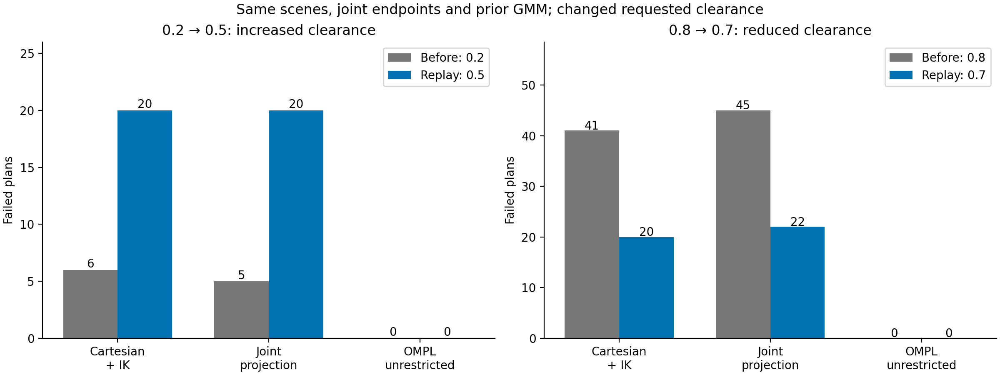
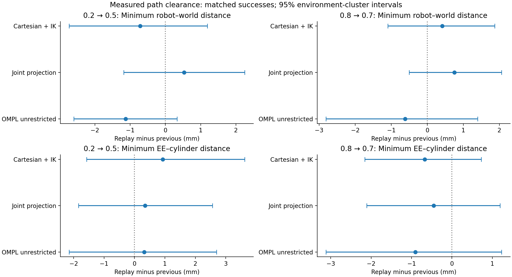

# Clearance sensitivity of the pure GMM samplers

**Reducing requested clearance from 0.8 to 0.7 approximately halved observed failures in that subset, but the environment-level evidence is not statistically decisive.** Most remaining failures occur because the deformed corridor excludes the unchanged start state. The result supports clearance sensitivity of the complete GMM-guided pipeline; it does not establish goal-height mismatch as the cause or a reliability advantage for either GMM sampler.

Completed on 28 September 2026: **2,700 retained plans on the same 120 environments**, with exact source joint endpoints, geometry, model/checkpoint, planner settings, schedule, repeat counts and custom sampler seeds. The original primary cohort contributes 1,800 plans and the original confirmation cohort 900. This is a sensitivity replay, not another independent confirmation. All repositories remain on `sampling-approaches-cod`.

## Before and after

The original two clearance levels **0.2 / 0.8 map to 0.5 / 0.7**. Only 0.8→0.7 is a reduction; the other group increases clearance. Values are normalized RL inputs, not distances in metres. Each transition contains 60 environments and 450 plans per method, pooled descriptively across cohorts.

| Requested clearance | Method | Previous failures | Replay failures | Environment-weighted success change (pp), 95% CI | Holm p |
|---|---|---:|---:|---:|---:|
| **0.8 → 0.7** | Cartesian + IK | 41/450 | **20/450** | +3.67 [0.00, 8.67] | 0.500 |
| **0.8 → 0.7** | Joint projection | 45/450 | **22/450** | +4.17 [0.17, 9.17] | 0.375 |
| 0.8 → 0.7 | OMPL unrestricted | 0/450 | 0/450 | 0.00 [0.00, 0.00] | 1.000 |
| 0.2 → 0.5 | Cartesian + IK | 6/450 | 20/450 | −3.17 [−8.17, 0.33] | 1.000 |
| 0.2 → 0.5 | Joint projection | 5/450 | 20/450 | −3.33 [−8.33, 0.00] | 1.000 |
| 0.2 → 0.5 | OMPL unrestricted | 0/450 | 0/450 | 0.00 [0.00, 0.00] | 1.000 |

The mixed replay therefore improves total audited successes from **853→860/900** for Cartesian IK and **850→858/900** for projection. OMPL remains **900/900**. Raising the low-clearance group partly offsets the improvement in the reduced-clearance group. The two new levels are assigned to different source environments, so this is not a within-environment comparison of 0.5 against 0.7.

Independent units are environments. Inference gives equal weight to each environment, stratifies by source cohort and obstacle layout, and retains all repeats within each cluster. Raw counts weight the ten-repeat primary cohort more heavily than the five-repeat second cohort, so their percentage-point differences differ from the inferential estimates. Intervals use 20,000 stratified cluster bootstraps. Two-sided sign permutations use exact enumeration for small numbers of informative clusters, otherwise 100,000 draws. Holm correction covers three sampler success tests separately for each transition. Pointwise bootstrap intervals and corrected permutation p-values need not agree. All-success intervals do not establish perfect population reliability.

## What changed in the failures

At 0.8→0.7, shared start/corridor failures fell from **40 to 20 per GMM method**. Primary environments 12 and 39 became compatible with the deformed corridor; their 20 repeated requests account for most of the improvement. Primary environment 55 and second-cohort environments 10 and 52 still exclude their starts.

At 0.2→0.5, shared start/corridor failures increased from **5 to 20 per method**. Primary environment 4 and second-cohort environment 0 newly exclude their starts; second-cohort environment 22 remains incompatible. For clarity, one of the original confirmation cohort's three incompatible environments was at clearance 0.2, not 0.8.

Across the retained replay, Cartesian IK has **40 shared endpoint failures and no additional failures**. Projection has those same 40 plus **two returned-path audit rejections**: a corridor violation in primary environment 57/repeat 1, and a sampled collision in second-cohort environment 15/repeat 1. Both count as failures. There were no planning-stage failures in the retained replay. These results locate the dominant limitation in deformation/endpoint compatibility, rather than the choice between the two proposal mechanisms.

## Measured obstacle clearance

On pairs that succeed both before and after the 0.8→0.7 change:

| Method | Change in minimum robot–world clearance (mm), 95% CI | Change in minimum EE–cylinder clearance (mm), 95% CI | Matched plans / environments |
|---|---:|---:|---:|
| Cartesian + IK | +0.414 [−1.098, 1.871] | −0.674 [−2.157, 0.727] | 409 / 55 |
| Joint projection | +0.752 [−0.505, 2.055] | −0.450 [−2.110, 1.193] | 403 / 55 |

These intervals do not show a clear clearance reduction among matched successes. They do not establish equivalence or characterize the newly recovered plans, which had no successful prior path to pair with. Whole-robot/world clearance includes the table; EE–cylinder distance concerns the tool point only. Neither is identical to the policy's normalized clearance input or training reward.

## Sampler comparison in the new regime

| Reused cohort | Method | Audited success | Median successful action time (s) | Median joint travel (rad) | Median EE path length (m) |
|---|---|---:|---:|---:|---:|
| primary | Cartesian + IK | 580/600 | 0.1294 | 10.006 | 0.702 |
| primary | Joint projection | 579/600 | 0.1168 | 8.476 | 0.628 |
| primary | OMPL unrestricted | 600/600 | 0.1523 | 13.324 | 2.200 |
| second cohort | Cartesian + IK | 280/300 | 0.1265 | 10.364 | 0.727 |
| second cohort | Joint projection | 279/300 | 0.1229 | 8.941 | 0.668 |
| second cohort | OMPL unrestricted | 300/300 | 0.1436 | 13.276 | 2.064 |

Joint travel is MoveIt's distance-weighted sum of absolute joint changes. Medians above condition on audited success. Failure-penalized PAR2 charges a failure 6 s and caps successful action time at the 3 s budget. Primary mean PAR2 is 0.3296 s for Cartesian IK and 0.3306 s for projection; the paired difference is −0.0010 s, 95% CI [−0.0230, 0.0135], Holm p = 1.0. Neither cohort establishes superior GMM-sampler success or PAR2.

Projection retains shorter paths among matched successes. Cartesian-minus-projected joint travel is 1.374 rad [1.025, 1.733] in the primary cohort and 1.097 rad [0.432, 1.759] in the reused second cohort. The latter's original directional tests, reproduced as sensitivity analyses, give Holm p = 0.00702 for joint travel and 0.03402 for EE length. These reused environments cannot provide fresh independent confirmation. Path-quality effects are conditional on success and affected by survivor selection.

**Keep `joint_projected` as the provisional path-quality choice for the EV benchmark.** This replay is consistent with the original joint-travel result, while providing no success/runtime superiority claim. Primary median setup is about 18.45 ms for projection versus 0.038 ms for Cartesian IK; online sampling is about 0.146 ms versus 12.03 ms. Valid samples per proposal are approximately 27.2% versus 58.5%. Projection trades more setup and more rejected proposals for much cheaper online mapping. Per-stage detail, preparation timing and distribution diagnostics are retained in the phase results. Nested timers must not be added together.

## Controls, diagnosis and scope

- Covariance cutoff **2.0**, `proposal=gmm`, `uniform_fraction=0`, `cartesian_fraction=0`, strict MoveIt fallback disabled, one RRTConnect attempt, 3 s budget, no simplification, identical dense trajectory audit. **Zero explicit uniform attempts, zero missing-anchor rescues and zero projected online IK calls** were recorded. The exhausted-sampler runtime regression passed. The unrestricted baseline uses empty path constraints and uniform joint-space sampling.
- Exact case geometry, complete joint endpoints, frozen prior GMM payload, model/policy and runtime hashes were checked. All **120 live collision scenes** passed read-back verification. Goal z remains **0.45–0.54 m**; the checkpoint's saved training configuration lists **0.10–0.30 m**. This mismatch is documented but its causal effect is not tested here because goal height was held fixed.
- The first 2,700-plan replay attempt was **invalidated in full** after a new full-scene restoration path exposed stale monitored obstacle geometry despite successful service responses. The discrepancy was reproduced and corrected with explicit synchronization plus read-back verification. Both complete cohorts were restarted using the same frozen deformations; no failed trials were selectively replaced. See [diagnostic evidence](diagnostics/README.md) and the [protocol amendment](protocol.md#scene-restoration-amendment-before-the-retained-replay). Earlier progress counts from that attempt are not retained results.
- This was controller-free, plan-only simulation with sample/path visualization disabled during timing. The custom corridor is a union of boxes enclosing cutoff ellipsoids, while unrestricted OMPL has a larger feasible region. The comparison does not isolate proposal density alone. No fixed tool-orientation path constraint or EV disassembly geometry was introduced. Discrete auditing does not provide a continuous collision certificate.

## Files and reproduction

- [Paired before/after analysis](comparison/summary.md), including PDF/PNG figures, case-level failure transitions, clearance/path effects and verified input identities.
- [Primary cohort](primary/summary.md) and [reused second cohort](confirmation/summary.md): statistics, trial tables, endpoint checks, sampler diagnostics and figures.
- [Protocol](protocol.md), [commands](../../COMMANDS-cod.md), and [original study](../2026-09-26-pure-sampling/README.md).
- `raw-primary.tar.xz` and `raw-confirmation.tar.xz` contain frozen models/scenes/states, every outcome and trajectory, analysis outputs, scene verification and source/hash provenance. Extract with `tar -xJf ARCHIVE`; each produces its named phase directory. Every archived file was compared byte-for-byte by SHA-256 with its source.
- The invalidated attempts remain separately under the workspace's `sampling_results/*-invalidated-scene-update` directories; their paths and hashes are recorded in `diagnostics/invalidated_attempts.json`.
- `SHA256SUMS` identifies all packaged files. Custom seeds and execution order match the source; OMPL and IK RNG streams are not bit-identical between runs. No significance-based extension or new environment selection was performed.
