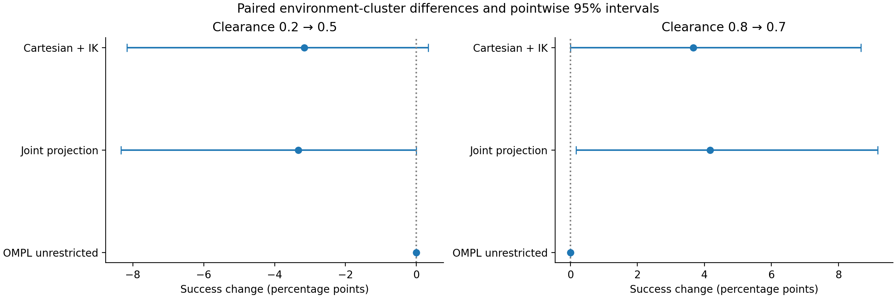

# Clearance sensitivity: paired replay results

120 reused environments; the requested RL clearance is the experimental change.

| Clearance | Sampler | Previous successes | Replay successes | Success change (pp), 95% cluster CI | Holm p |
|---|---|---:|---:|---:|---:|
| 0.2 → 0.5 | cartesian_ik | 444/450 | 430/450 | -3.17 [-8.17, 0.33] | 1 |
| 0.2 → 0.5 | joint_projected | 445/450 | 430/450 | -3.33 [-8.33, 0.00] | 1 |
| 0.2 → 0.5 | ompl_uniform | 450/450 | 450/450 | 0.00 [0.00, 0.00] | 1 |
| 0.8 → 0.7 | cartesian_ik | 409/450 | 430/450 | 3.67 [0.00, 8.67] | 0.5 |
| 0.8 → 0.7 | joint_projected | 405/450 | 428/450 | 4.17 [0.17, 9.17] | 0.375 |
| 0.8 → 0.7 | ompl_uniform | 450/450 | 450/450 | 0.00 [0.00, 0.00] | 1 |

Counts pool the two source cohorts; inferential differences give equal weight to each environment. Repeated plans are not independent observations. The two clearance transitions have separate three-sampler Holm families. Pointwise bootstrap intervals and corrected sign-test p-values need not agree, particularly with few discordant environments.

The 0.8→0.7 subset directly tests reduced clearance. The 0.2→0.5 subset is an increase; do not describe the complete replay as uniformly lowering clearance. Unrestricted OMPL does not use the clearance input, so its differences measure stochastic rerun variability.

## Failure mechanisms

| Clearance | Sampler | Previous | Replay |
|---|---|---|---|
| 0.2 → 0.5 | cartesian_ik | {"path_audit": 1, "start_invalid_in_corridor": 5} | {"start_invalid_in_corridor": 20} |
| 0.2 → 0.5 | joint_projected | {"start_invalid_in_corridor": 5} | {"start_invalid_in_corridor": 20} |
| 0.2 → 0.5 | ompl_uniform | {} | {} |
| 0.8 → 0.7 | cartesian_ik | {"start_invalid_in_corridor": 40, "path_audit": 1} | {"start_invalid_in_corridor": 20} |
| 0.8 → 0.7 | joint_projected | {"start_invalid_in_corridor": 40, "planning": 3, "path_audit": 2} | {"start_invalid_in_corridor": 20, "path_audit": 2} |
| 0.8 → 0.7 | ompl_uniform | {} | {} |

Detailed matched-success clearance/path effects and case-level failure transitions are in `clearance_comparison.json`. The saved inputs were verified bit-for-bit for case geometry, complete joint states, scene and prior GMM payload (ignoring the model header timestamp). Policy/checkpoint and action scale were also verified. Cutoff 2.0 and strict no-fallback sampling remain in force.

Goal heights remain in the original case-study range, 0.45–0.54 m. The saved training configuration uses 0.10–0.30 m. A change in outcomes cannot isolate goal-height mismatch as the cause because this replay did not change goal height.
