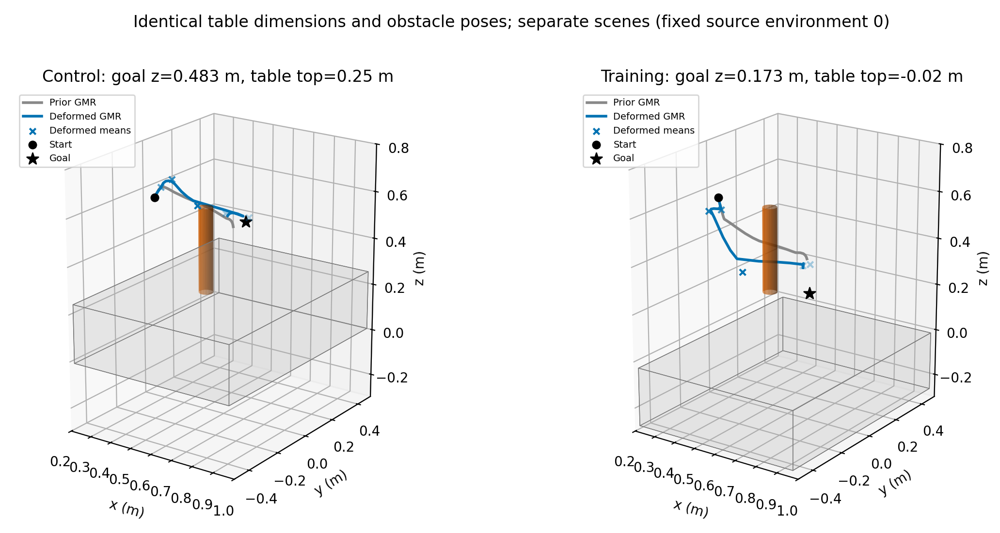
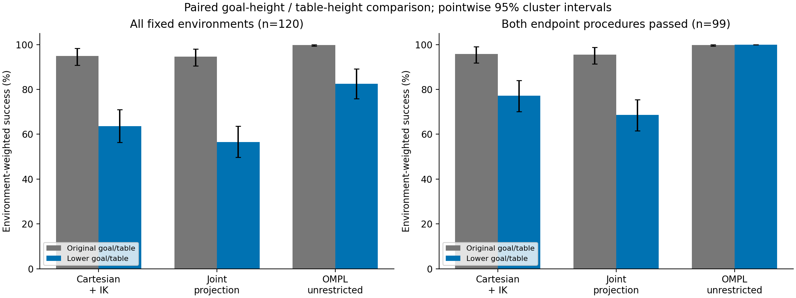
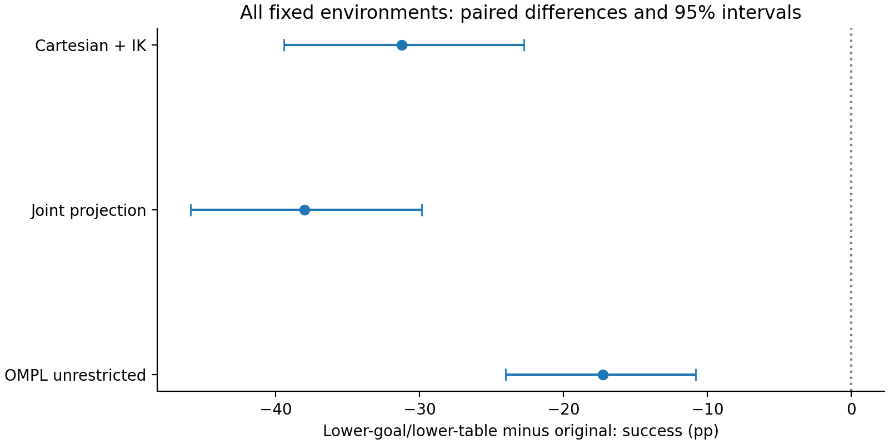
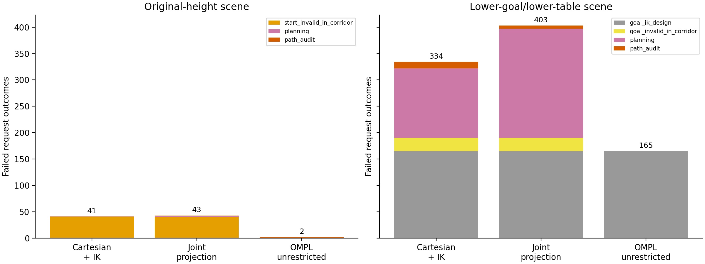

# Goal-height / table-height sensitivity

Training-height arrangement minus original-height control; goal and table both change. Reused environments. Endpoint-solve failures are not proofs of unreachability.

| Method | Original successes | Lower-goal/table successes | Success change (pp), 95% CI | Holm p |
|---|---:|---:|---:|---:|
| cartesian_ik | 859/900 | 566/900 | -31.25 [-39.42, -22.75] | 2.99997e-05 |
| joint_projected | 857/900 | 497/900 | -38.00 [-45.92, -29.83] | 2.99997e-05 |
| ompl_uniform | 898/900 | 735/900 | -17.25 [-24.00, -10.83] | 2.99997e-05 |

Inference gives each source environment equal weight; raw counts weight cohorts with different repeat counts differently. Primary Holm correction covers the three success contrasts. The conditional analysis below is secondary and uses only environments where both fixed endpoint procedures passed. It does not erase endpoint failures from the main analysis.

Endpoint procedures passed in both arrangements for 99/120 source environments.

| Method | Original successes on endpoint-feasible subset | Lower arrangement successes |
|---|---:|---:|
| cartesian_ik | 704/735 | 566/735 |
| joint_projected | 702/735 | 497/735 |
| ompl_uniform | 734/735 | 735/735 |

The fixed example shows GMR reference curves and Gaussian means, not planned paths. Cylinder poses are unchanged in these plan-only scenes; no gravity simulation is applied.

The intervention changes table position and the geometric planning task as well as the goal-height distribution. It cannot attribute an effect uniquely to RL generalization or rule out every other cause. The checkpoint, clearance 0.5/0.7, cutoff 2.0 and strict sampling settings are unchanged. Timings/path lengths must be interpreted in light of changed geometry and survivor selection. Detailed matched-success effects, per-clearance/per-cohort counts and failure cases are in `statistics.json`.
