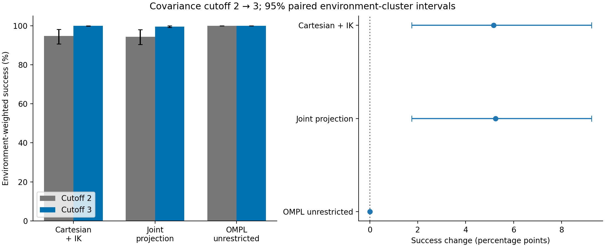
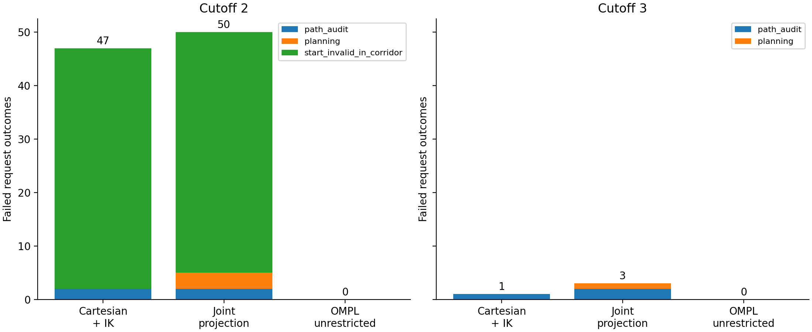
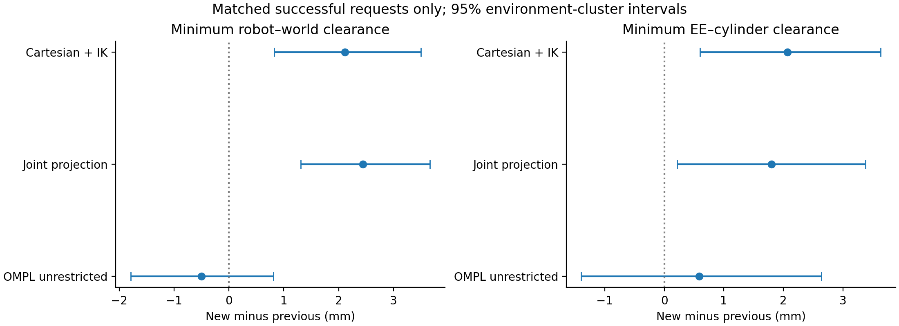
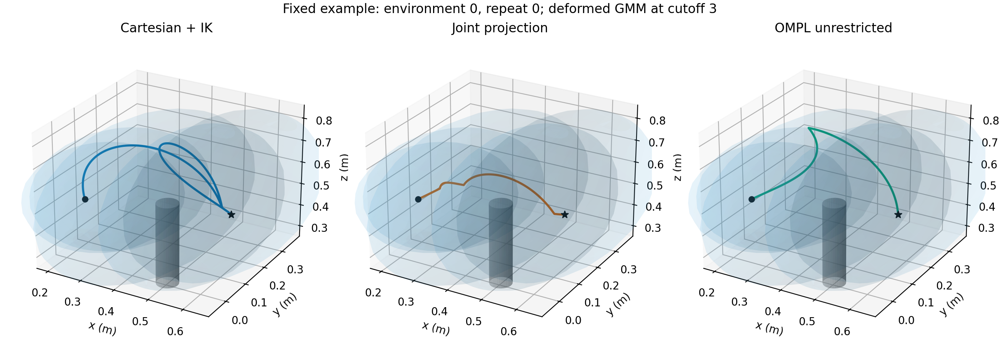

# Covariance cutoff 3.0 on the original-height scene

**Widening the covariance cutoff from 2.0 to 3.0 removed all 45 start/corridor failures per GMM method and substantially improved audited success.** Cartesian + IK reached **899/900**, joint projection **897/900**, and unrestricted OMPL **900/900**. Both GMM improvements pass the paired environment-level success tests with Holm p = **0.02930**. This supports cutoff/corridor sensitivity of the complete planning pipeline; it does not isolate proposal density from the size of the allowed planning region.

Completed on 29 September 2026: **2,700 request outcomes across the same 120 original environments**, using clearances **0.2 / 0.8**, the original table surface at **z=0.25 m**, and original goals at **z=0.45–0.54 m**. The first cohort has 60 environments × 10 repeats × 3 methods; the second has 60 × 5 × 3. Neither the lowered table nor the training-height goals are used here. All repositories remain on `sampling-approaches-cod`.

## Success and failure causes

| Method | Cutoff 2.0 successes | Cutoff 3.0 successes | Environment-weighted change (pp), 95% CI | Holm p |
|---|---:|---:|---:|---:|
| Cartesian + IK | 853/900 | **899/900 (99.89%)** | +5.17 [1.75, 9.25] | 0.02930 |
| Joint projection | 850/900 | **897/900 (99.67%)** | +5.25 [1.75, 9.25] | 0.02930 |
| OMPL unrestricted | 900/900 | **900/900 (100%)** | 0.00 [0.00, 0.00] | 1.000 |

Inference gives each environment equal weight, preserving repeats within clusters and stratifying by cohort, obstacle layout and clearance. Raw counts give more weight to the ten-repeat cohort, so their percentage changes differ from the environment-weighted estimates. Intervals use 20,000 cluster bootstraps; paired two-sided sign tests use exact enumeration for at most 16 informative environments, otherwise 100,000 permutations. One Holm correction covers the three primary sampler success tests. Pointwise intervals are not multiplicity-adjusted, and all-success intervals do not establish perfect population reliability.

| Method | Previous failure stages | Cutoff 3.0 failure stages |
|---|---|---|
| Cartesian + IK | 45 start/corridor; 2 path audit | **1 path audit** |
| Joint projection | 45 start/corridor; 3 planning; 2 path audit | **1 planning; 2 path audit** |
| OMPL unrestricted | none | none |

The unchanged starts are now compatible with the wider corridor. This is direct evidence for a geometric source of the earlier failures: the corridor previously excluded valid starts. It does not show that the RL policy alone became more capable, because its deformed GMMs are identical to the original ones.

Every remaining failure is retained. The dense path audit rejected three planner-reported successes, each with one sampled collision: primary environment 48/repeat 6 (Cartesian), primary environment 19/repeat 4 (projection), and second-cohort environment 4/repeat 1 (projection). None of these three had a recorded corridor violation. Projection also failed planning in second-cohort environment 32/repeat 3 after 3.089 s. The three audited paths must not be treated as successful collision-free solutions.

Clearance-stratified counts are descriptive; the two levels belong to different source environments, not a within-environment clearance sweep. Each cell has 450 requests:

| Requested RL clearance | Method | Cutoff 2.0 successes | Cutoff 3.0 successes |
|---|---|---:|---:|
| 0.2 | Cartesian + IK | 444 | 449 |
| 0.2 | Joint projection | 445 | 449 |
| 0.2 | OMPL unrestricted | 450 | 450 |
| 0.8 | Cartesian + IK | 409 | 450 |
| 0.8 | Joint projection | 405 | 448 |
| 0.8 | OMPL unrestricted | 450 | 450 |

## Path quality and clearance tradeoff

The larger cutoff admits more spatial spread. On requests successful at both cutoffs, both custom methods produce longer paths on average, with small increases in measured obstacle clearance:

| Method | Joint travel change (rad), 95% CI | EE length change (cm), 95% CI | Robot–world clearance change (mm), 95% CI | EE–cylinder clearance change (mm), 95% CI |
|---|---:|---:|---:|---:|
| Cartesian + IK | +0.881 [0.474, 1.284] | +8.842 [6.464, 11.215] | +2.116 [0.824, 3.502] | +2.068 [0.602, 3.635] |
| Joint projection | +0.575 [0.188, 0.960] | +5.702 [3.338, 8.055] | +2.445 [1.313, 3.667] | +1.801 [0.216, 3.384] |

These secondary estimates use 852 Cartesian and 848 projected matched successful requests across 114 environments. They exclude newly recovered paths without a successful prior counterpart and are subject to survivor selection. Joint travel is MoveIt's distance-weighted sum of absolute joint changes. Robot–world clearance includes all robot links and the table; EE–cylinder clearance measures the tool point. Requested clearance is a normalized RL input, not a distance in metres or a guaranteed path margin.

Within cutoff 3.0, projection still produces shorter paths than Cartesian + IK among matched successes. Cartesian-minus-projected joint travel is **0.839 rad [0.336, 1.332]** in the first cohort and **1.548 rad [1.003, 2.094]** in the second. The corresponding EE differences are **5.579 cm [2.126, 9.083]** and **7.286 cm [3.484, 11.058]**. The original second-cohort directional tests, rerun as sensitivity analyses, give Holm p = 0.000040 for joint travel and 0.001340 for EE length.

This fixed example shows end-effector paths and the deformed GMM at cutoff 3.0; it is not selected for its outcome. The blue ellipsoids show proposal support, whereas the hard planning corridor is a union of enclosing oriented boxes. The unrestricted baseline has no GMM corridor. The figure omits the robot links and table mesh; the exact table is retained in all collision scenes and audits.

## Runtime and sampler behavior

| Reused cohort | Method | Success | Median successful action (s) | Median joint travel (rad) | Median EE length (m) | Mean PAR2 (s) |
|---|---|---:|---:|---:|---:|---:|
| first | Cartesian + IK | 599/600 | 0.1505 | 11.615 | 0.798 | 0.1675 |
| first | Joint projection | 599/600 | 0.1465 | 10.827 | 0.720 | 0.1648 |
| first | OMPL unrestricted | 600/600 | 0.1657 | 13.361 | 2.135 | 0.1766 |
| second | Cartesian + IK | 300/300 | 0.1335 | 11.640 | 0.832 | 0.1441 |
| second | Joint projection | 298/300 | 0.1358 | 9.691 | 0.715 | 0.1920 |
| second | OMPL unrestricted | 300/300 | 0.1544 | 13.413 | 2.146 | 0.1579 |

PAR2 assigns failures 6 s and caps successful action time at the 3 s planning budget. Relative to cutoff 2.0, environment-weighted mean PAR2 improves by **0.290 s [0.088, 0.529]** for Cartesian and **0.293 s [0.090, 0.531]** for projection, largely because endpoint failures disappear. Observed mean action time rises by about 20 ms and 15 ms respectively; the unchanged OMPL baseline also rises by about 15 ms, so a causal runtime penalty cannot be assigned solely to cutoff.

Neither cohort establishes a success or PAR2 advantage of one GMM sampler over the other after its within-cohort correction. Cartesian's second-cohort PAR2 advantage over unrestricted OMPL has Holm p = 0.00222, but it concerns action time; GMM preparation adds overhead, and this is reused-cohort sensitivity evidence. Successful pipeline medians including model preparation are approximately 0.178/0.177/0.167 s for Cartesian/projection/OMPL in the first cohort and 0.161/0.163/0.156 s in the second. Endpoint design and offline path auditing are outside those pipeline timers.

Projection retains its implementation tradeoff: median setup is approximately 21–23 ms, mostly anchor IK, with about 0.1–0.2 ms of online sampling. Cartesian setup is negligible but online IK/sampling takes about 9 ms. Accepted samples per proposal are 53.8%/52.9% for Cartesian and 19.0%/12.6% for projection in the two cohorts. These are aggregate ratios and can be dominated by difficult requests; the second-cohort projected planning failure contributes many attempts. Setup/sampling totals contain nested IK, Jacobian, FK and validity timers and must not be added to those sub-timers. TP-GMM reproduction, RL deformation, regression, model loading and distribution diagnostics are supplied in the cohort reports.

**Joint projection remains the provisional choice when shorter paths are the priority**, supported by the original study and this sensitivity rerun. This experiment does not establish superior reliability or runtime over Cartesian + IK. Cutoff 3.0 is a promising setting for the requested original-height scene, with an explicit path-spread tradeoff; selecting it from these sensitivity runs still requires evaluation on independent benchmark environments.

## Controls, validation and reproduction

- Only cutoff changes from 2.0 to 3.0. Means, covariances, weights, original/deformed GMR references, complete joint endpoints, cylinder geometry, table, checkpoint/action scale, schedule and custom seeds match the source. All 120 live collision scenes passed read-back verification. The goal-height mismatch with the checkpoint's saved training range (0.10–0.30 m) is intentionally retained here.
- Both custom methods use GMM proposals, covariance corridors, zero uniform/cartesian mixtures and strict MoveIt fallback disabled. All recorded cutoffs are 3.0; **zero uniform attempts, zero missing-anchor rescues, and zero projected online IK calls** were recorded. The cutoff-3.0 exhausted-sampler runtime test passed before measurements. OMPL uses empty path constraints and unrestricted bounded joint-space sampling.
- Same RRTConnect, one attempt, 3 s budget, no simplification and dense returned-path audit. Controller-free, plan-only runs were sequential in isolated ROS domain 81 with visualization disabled during timing. Gazebo entities and the separate active Gazebo session were not changed. No outcome-based extension, rerun replacement or exclusion occurred.
- These are reused environments. The significance results are conditional sensitivity evidence within the declared test family, not new independent confirmation after the earlier clearance/height investigations. The wider hard corridor changes feasible-region size as well as proposal support. The methods differ in orientation behavior, and projected Cartesian distributions use a local approximation. Discrete auditing does not certify continuous collision freedom.
- All runtime/model hashes still match the source after rebuilding. **20 targeted unit tests**, the strict runtime regression, package build and three installed CLI help checks passed. Existing converter indentation warnings remain; there were no build errors. No changes were committed in this turn.

Files:

- [Paired cutoff analysis](comparison/summary.md), [statistics](comparison/statistics.json), [input identities](comparison/input_verification.json) and [validation](comparison/validation.json).
- [First cohort](primary/summary.md) and [reused second cohort](confirmation/summary.md): statistics, trial tables, endpoint audits, distribution diagnostics, and PNG/PDF figures.
- [Protocol fixed before measurements](protocol.md), [commands](../../COMMANDS-cod.md), and [original cutoff-2.0 case study](../2026-09-26-pure-sampling/README.md).
- `raw-primary.tar.xz` and `raw-confirmation.tar.xz` retain all frozen scenes, states, models, references, outcomes, trajectories, scene checks, source snapshots and provenance. Extract with `tar -xJf ARCHIVE`; each creates its named cohort directory. Every archived file was checked against its source by SHA-256.
- [Archive verification](archive_verification.json), `provenance/`, and `SHA256SUMS` preserve audit/build/source records and packaged-file identities. OMPL and IK RNG streams are independent across reruns despite preserving custom proposal seeds and method order.
