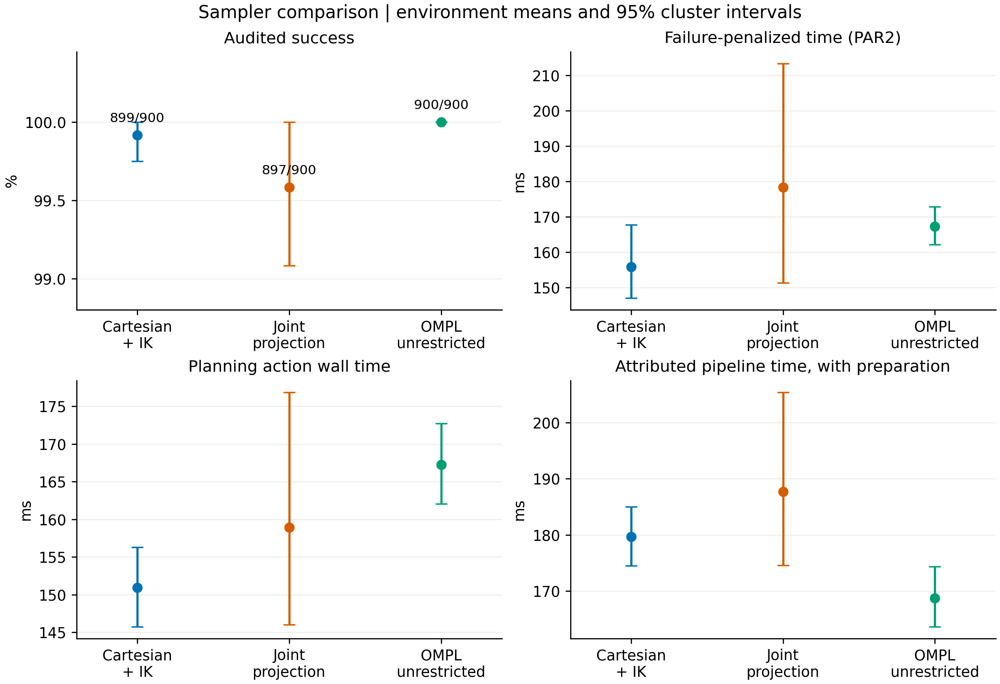
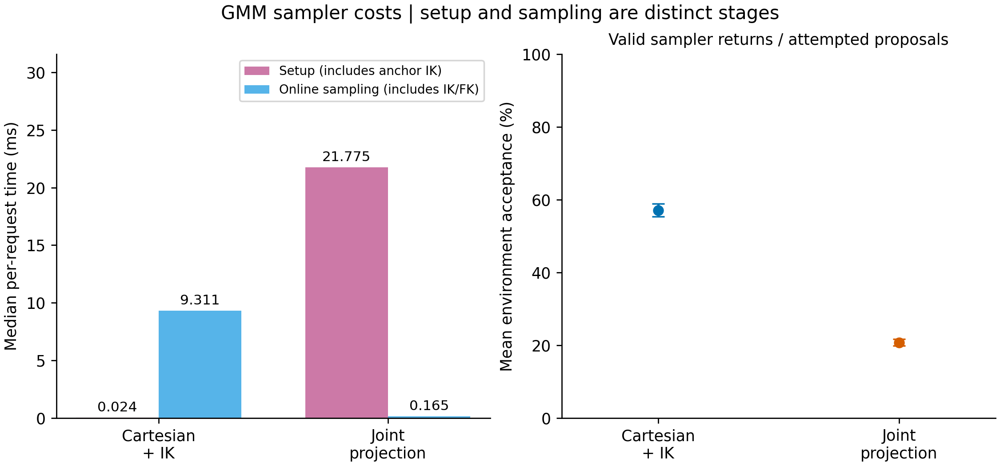

# GMM samplers and unrestricted OMPL: journal case study

This package compares **Cartesian + IK, joint projection and unrestricted OMPL at one fixed configuration**: covariance cutoff 3.0, normalized RL clearance inputs 0.2/0.8, and the original table scene. It contains only between-sampler findings. No paired cutoff effects enter its analysis, tables, figures or manuscript section, and no additional planning runs were performed.

**The strongest result is shorter paths with joint projection than with Cartesian + IK.** Neither GMM method has a statistically supported success or total-latency advantage over the other. Both GMM configurations produce shorter unsimplified paths than unrestricted OMPL, while OMPL has lower attributed pipeline latency and greater measured robot-to-world clearance in these environments.

Start with the [manuscript section](manuscript.md), supplied also as a [LaTeX fragment](manuscript.tex). The draft includes experimental methods, statistics, results, implementation tradeoffs and a qualified sampler-selection rationale. It does not include the earlier diagnostic comparison.

## Main findings

| Method | Audited successes | Mean action time (ms) | Mean attributed pipeline (ms) | Mean joint travel (rad) | Mean EE length (m) |
|---|---:|---:|---:|---:|---:|
| Cartesian + IK | 899/900 | 150.94 | 179.66 | 10.847 | 0.853 |
| Joint projection | 897/900 | 158.90 | 187.71 | 9.645 | 0.788 |
| OMPL unrestricted | 900/900 | 167.25 | 168.74 | 13.820 | 2.218 |

Means give each of the **120 environments equal weight**; path means use successful requests within each environment. The 2,700 total requests comprise ten repeats per method in one 60-environment cohort and five in another. Raw counts, request medians and environment-level means are separately identified in the exports.



The joint-projected method reduces joint travel by **1.194 rad [0.826, 1.563]** and EE length by **6.43 cm [3.89, 9.01]** relative to Cartesian + IK on 896 matched successful request pairs across 120 environments. Both have Holm-adjusted p < 0.001. No method pair has a supported success or PAR2 advantage after correction; lack of significance is not evidence of equivalence.

The baseline tradeoff matters. Relative to OMPL, mean paired EE length is shorter by **1.364 m** with Cartesian and **1.430 m** with projection. OMPL's minimum robot–world clearance is greater by **3.83 mm** and **5.34 mm**, respectively; all four effects have adjusted p < 0.001. Cartesian action time is lower than OMPL's, but preparation changes the pipeline ordering: attributed GMM pipeline latency is higher by **10.92 ms [5.68, 16.04]** for Cartesian and **18.97 ms [6.32, 35.43]** for projection. The two custom samplers' latency differences are not supported after correction.

## Advantages and limitations

| Method | Advantages supported here | Costs and limitations |
|---|---|---|
| Cartesian + IK | Direct truncated-GMM spatial proposals before IK; negligible setup; higher valid-proposal fraction | Online IK cost; branch selection and validity filtering change the accepted state distribution; longer paths than projection |
| Joint projection | Shorter joint and EE paths; cheap online draws; no online IK | Anchor-IK setup; local Jacobian approximation and orientation drift; lower acceptance; missing-anchor and trust-region restrictions; no demonstrated reliability/latency superiority |
| OMPL unrestricted | No learned-model dependency or preparation; complete observed success; lower attributed pipeline latency and greater robot–world clearance | Longer unsimplified paths; no adherence to a learned corridor; a different allowed planning region from the GMM configurations |

Median setup/sampling times are **0.024/9.311 ms** for Cartesian and **21.775/0.165 ms** for projection. Mean environment-level valid-proposal fractions are **57.13%** and **20.74%**; aggregating all attempt counts gives 53.47% and 12.98%. The latter is more sensitive to difficult requests. OMPL internal sampler counters are unavailable and are not represented as zero efficiency.



Select joint projection provisionally for the later EV benchmark **if shorter paths are the stated criterion**, and fix that choice before evaluating independent EV scenes. The evidence does not justify calling it universally faster, safer or more reliable.

## Statistical and experimental scope

- **One fixed-configuration dataset:** all 2,700 outcomes are retained. Three planner-reported successes fail the dense collision audit, and one projected request fails planning. All four count as failures. Recorded uniform fallback, missing-anchor rescue and projected online IK counters are zero.
- **Retrospective combined analysis:** configurations were selected during preliminary diagnostics on these environments. The combined results are exploratory, not fresh confirmatory evidence. Inference uses paired environment-level effects, 20,000 stratified cluster bootstraps and two-sided sign-permutation tests. A single Holm family covers all **24 tests**: three method pairs × success, PAR2, action latency, pipeline latency, joint travel, EE length, robot–world clearance and EE–cylinder clearance. Pointwise confidence intervals are not multiplicity-adjusted. The p-values are for these sampler contrasts, not the diagnostic study's hypotheses.
- **Fair interpretation of the baseline:** all methods share scenes, start/goal states, collision checks, RRTConnect, a 3 s budget and no simplification. The GMM methods additionally constrain the EE origin to a union of covariance-derived boxes; OMPL has empty path constraints. Orientation behavior also differs. These are complete planning configurations, not an ablation that isolates only proposal density.
- **Timing definitions:** pipeline latency attributes the shared per-environment deformation-service measurement to each GMM request, then adds its preparation/preflight and planning-action latency. It does not measure a fresh deformation execution for every repeat. Common endpoint IK and offline path audit are excluded. Sampler setup and sampling contain nested IK/FK/validity timers; do not add the nested values again. Stage medians describe individual requests, while inferential means weight environments equally.
- **Clearance and generalization:** robot–world distance uses padded world geometry and the allowed-collision matrix; it excludes self-distance. The dense validity audit checks collisions separately. The normalized RL input is not a guaranteed metric clearance. Goals are z=0.45–0.54 m while the checkpoint's saved training goal range is z=0.10–0.30 m. This comparison characterizes that fixed policy/scene regime; it does not establish EV-disassembly transfer or continuous collision freedom.
- **Path-quality conditioning:** paired path effects use successful requests under both compared methods. Failure rates remain separate. Differences between the table's individual method means need not exactly equal the paired effects because the eligible success sets differ.

## Manuscript and supplementary files

- [manuscript.md](manuscript.md) and [manuscript.tex](manuscript.tex): draft journal section. The LaTeX fragment uses standard `amsmath`, `amssymb`, `graphicx`, `longtable`, `booktabs`, `array`, `calc` and `hyperref` support; adapt table/figure placement to the journal template. It is supplied as source, not a compiled manuscript PDF.
- [statistics.json](statistics.json): all estimates, intervals, adjusted tests, cohort/stratum results, preparation timings, counters and configuration.
- [tables/sampler_summary.csv](tables/sampler_summary.csv), [tables/pairwise_comparisons.csv](tables/pairwise_comparisons.csv), [tables/environment_metrics.csv](tables/environment_metrics.csv) and [tables/trial_metrics.csv](tables/trial_metrics.csv): numeric exports, retaining repeat and cohort identities. All quality contrasts cover 120 environments; matched request counts are 896 (Cartesian/projected), 899 (Cartesian/OMPL) and 897 (projected/OMPL).
- [Figure captions](figure_captions.md): standalone descriptions for all six figures. `figures/` supplies matching vector PDFs and PNG previews.
- [analysis_inputs.json](analysis_inputs.json), [data_sources.json](data_sources.json), [validation.json](validation.json) and `provenance/`: input identities, source/hash records and analysis checks. `SHA256SUMS` identifies the completed package.
- Frozen raw planning data remain in the verified [first-cohort archive](../2026-09-29-cutoff3/raw-primary.tar.xz) and [second-cohort archive](../2026-09-29-cutoff3/raw-confirmation.tar.xz). Only their fixed-cutoff sampler outcomes are used here. No original records or diagnostic reports were changed.

## Reproduction

From the workspace root:

```bash
python3 src/tp_gmm/scripts/summarize_sampler_case_study.py \
  sampling_results/2026-09-29-cutoff3-primary \
  sampling_results/2026-09-29-cutoff3-confirmation \
  --output sampling_results/my-sampler-comparison
```

The command refuses to overwrite an existing output and rejects differing cohort configurations, duplicate environments, invalid scene checks, changed frozen-input hashes and impure sampler telemetry. It generates the numeric analysis, CSV tables and figures; the manuscript and this report are editorial documents based on those outputs. To reproduce from the raw archives, extract them into a separate directory and pass the resulting `primary` and `confirmation` paths. Statistical seeds and the original analysis sources are stored in this package. No ROS planning server is needed for analysis.
