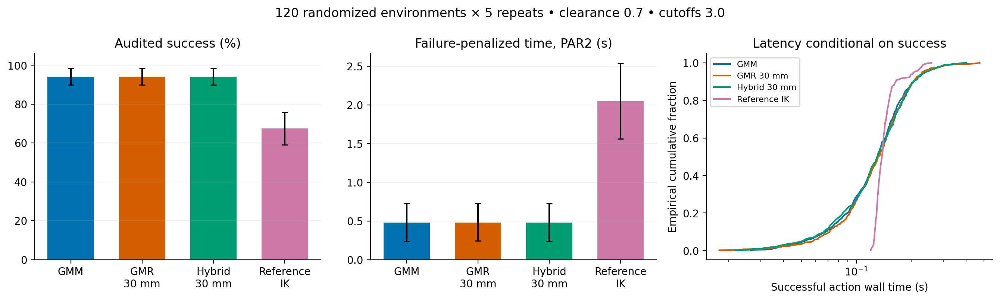
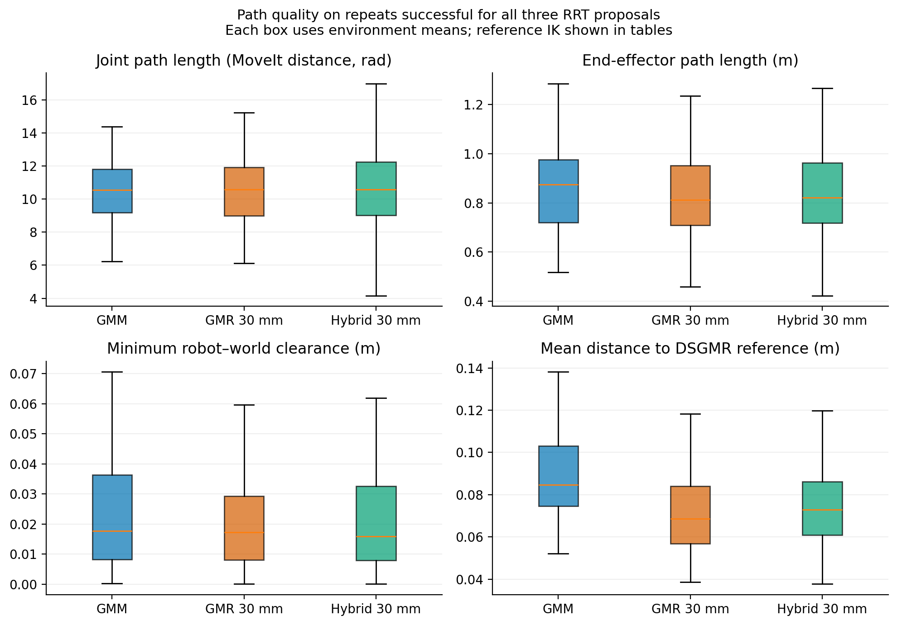
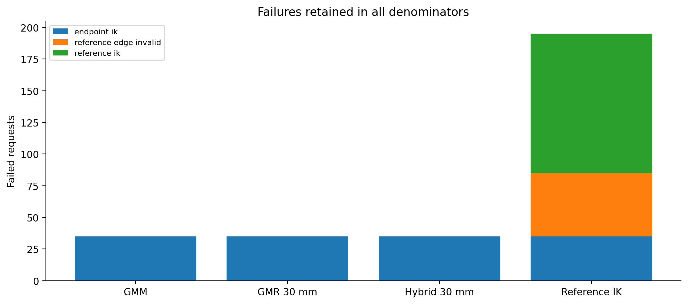
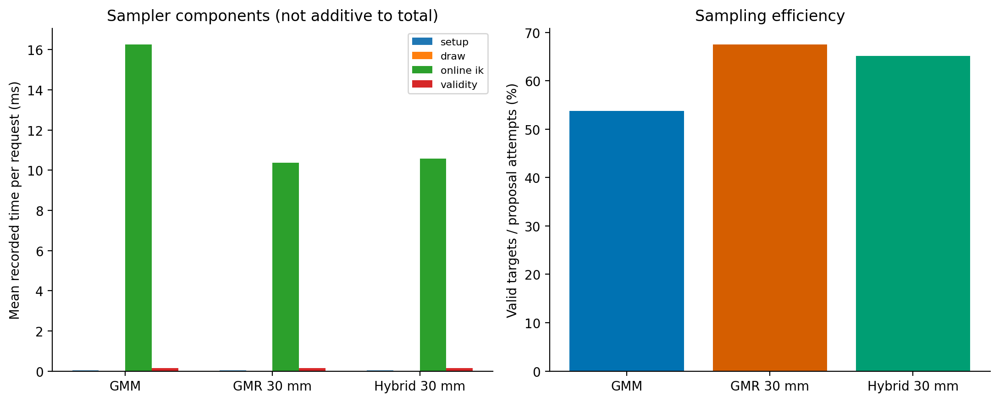
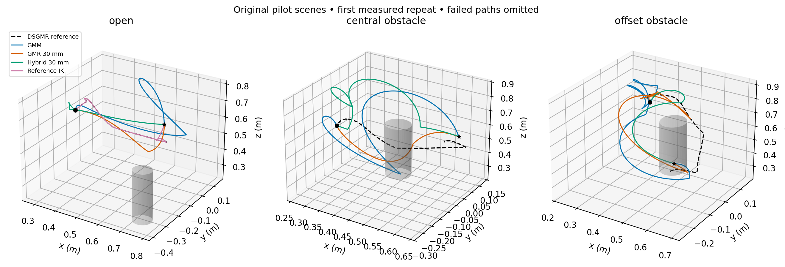

# Strict GMM / GMR proposal comparison

Completed 2400 measured outcomes in 120 new randomized environments, plus 120 measured outcomes on the three original pilot scenes. 12 warmups excluded.

**Settings:** GMM cutoff 3.0; GMR radial cutoff 3.0; clearance input 0.7; GMR standard deviation 30 mm; hybrid 80% GMR / 20% GMM; Cartesian + IK mapping; RRTConnect, 3 s budget, no simplification. The reference is the frozen post-RL DSGMR rollout. Uniform mixture and MoveIt wrapper fallback are disabled.

| Method | Audited success | Environment-bootstrap 95% CI | Mean PAR2 (s) | Successful median action (ms) | Proposal acceptance |
|---|---:|---:|---:|---:|---:|
| GMM | 565/600 (94.2%) | 90.0%–98.3% | 0.478 | 131.4 | 53.8% |
| GMR 30 mm | 565/600 (94.2%) | 90.0%–98.3% | 0.480 | 131.9 | 67.5% |
| Hybrid 30 mm | 565/600 (94.2%) | 90.0%–98.3% | 0.478 | 130.2 | 65.2% |
| Reference IK | 405/600 (67.5%) | 59.2%–75.8% | 2.048 | 138.1 | n/a |

## Inference

Environment is the independent unit. Confidence intervals use 20,000 layout-stratified cluster bootstrap samples. Primary comparisons use paired environment sign permutations and Holm correction across all six method pairs × two metrics. PAR2 assigns 6 s to every failure; successful action time is capped at 3 s. Repeats are not treated as independent experimental units.

| Contrast (A − B) | Metric | Difference [95% CI] | Holm p |
|---|---|---:|---:|
| GMM − GMR 30 mm | success | 0.000 [0.000, 0.000] pp | 1 |
| GMM − GMR 30 mm | par2_s | -0.002 [-0.008, 0.003] s | 1 |
| GMM − Hybrid 30 mm | success | 0.000 [0.000, 0.000] pp | 1 |
| GMM − Hybrid 30 mm | par2_s | -0.001 [-0.007, 0.006] s | 1 |
| GMM − Reference IK | success | 26.667 [19.167, 35.000] pp | 0.00012 |
| GMM − Reference IK | par2_s | -1.570 [-2.052, -1.130] s | 0.00012 |
| GMR 30 mm − Hybrid 30 mm | success | 0.000 [0.000, 0.000] pp | 1 |
| GMR 30 mm − Hybrid 30 mm | par2_s | 0.002 [-0.005, 0.008] s | 1 |
| GMR 30 mm − Reference IK | success | 26.667 [19.167, 35.000] pp | 0.00012 |
| GMR 30 mm − Reference IK | par2_s | -1.568 [-2.048, -1.128] s | 0.00012 |
| Hybrid 30 mm − Reference IK | success | 26.667 [19.167, 35.000] pp | 0.00012 |
| Hybrid 30 mm − Reference IK | par2_s | -1.569 [-2.051, -1.130] s | 0.00012 |

## Path quality on paired successes

Each contrast uses repeats where both methods succeeded, averages the paired difference within each environment, then weights environments equally. These results are conditional on success and do not replace the reliability comparison. The separate 12-test secondary family covers three RRT proposal pairs × four quality metrics. Reference IK quality is descriptive.

| Contrast (A − B) | Metric | Mean difference [95% CI] | Matched repeats / environments | Holm p |
|---|---|---:|---:|---:|
| GMM − GMR 30 mm | joint_path_length | -0.12779 [-0.53676, 0.27686] | 565 / 113 | 1 |
| GMM − GMR 30 mm | ee_path_length_m | 0.03276 [-0.00158, 0.06753] | 565 / 113 | 0.6066 |
| GMM − GMR 30 mm | min_world_clearance_m | 0.00155 [-0.00021, 0.00326] | 565 / 113 | 0.6681 |
| GMM − GMR 30 mm | reference_deviation_mean_m | 0.01720 [0.01344, 0.02105] | 565 / 113 | 0.00012 |
| GMM − Hybrid 30 mm | joint_path_length | -0.10326 [-0.56195, 0.35376] | 565 / 113 | 1 |
| GMM − Hybrid 30 mm | ee_path_length_m | 0.02194 [-0.01583, 0.05898] | 565 / 113 | 1 |
| GMM − Hybrid 30 mm | min_world_clearance_m | 0.00220 [0.00051, 0.00396] | 565 / 113 | 0.1482 |
| GMM − Hybrid 30 mm | reference_deviation_mean_m | 0.01341 [0.00933, 0.01750] | 565 / 113 | 0.00012 |
| GMR 30 mm − Hybrid 30 mm | joint_path_length | 0.02453 [-0.43890, 0.49344] | 565 / 113 | 1 |
| GMR 30 mm − Hybrid 30 mm | ee_path_length_m | -0.01081 [-0.04958, 0.02687] | 565 / 113 | 1 |
| GMR 30 mm − Hybrid 30 mm | min_world_clearance_m | 0.00065 [-0.00110, 0.00253] | 565 / 113 | 1 |
| GMR 30 mm − Hybrid 30 mm | reference_deviation_mean_m | -0.00379 [-0.00804, 0.00044] | 565 / 113 | 0.6681 |

## Descriptive path medians

These use each method’s successful requests; reference IK has a smaller conditioning set. Use the paired contrasts above for comparative inference.

| Method | Successful requests | Joint length (MoveIt distance, rad) | EE length (m) | World clearance (mm) | Mean reference deviation (mm) |
|---|---:|---:|---:|---:|---:|
| GMM | 565 | 11.240 | 0.795 | 14.724 | 83.484 |
| GMR 30 mm | 565 | 11.345 | 0.755 | 13.810 | 62.244 |
| Hybrid 30 mm | 565 | 11.360 | 0.758 | 13.503 | 65.134 |
| Reference IK | 405 | 4.939 | 0.709 | 24.117 | 3.934 |

## Failures and original-scene replication

- **GMM:** randomized failures `{"endpoint_ik": 35}`; original scenes 30/30 successes.
- **GMR 30 mm:** randomized failures `{"endpoint_ik": 35}`; original scenes 30/30 successes.
- **Hybrid 30 mm:** randomized failures `{"endpoint_ik": 35}`; original scenes 30/30 successes.
- **Reference IK:** randomized failures `{"endpoint_ik": 35, "reference_edge_invalid": 50, "reference_ik": 110}`; original scenes 10/30 successes.

## Interpretation and limits

- GMM explores the full truncated learned mixture. GMR concentrates its proposals around the reproduced reference, while the hybrid retains a broader GMM component. Accepted targets are also conditioned on IK feasibility, collisions and the hard GMM corridor; RRT vertices need not follow the proposal distribution.
- Reference IK follows the rollout without search or detour repair and must connect the actual task endpoints. Its timing includes public IK/FK/validity-service calls and it returns an untimed geometric path. It is a feasibility baseline; runtime differences also reflect architecture. It is not an unrestricted OMPL baseline.
- All four methods use identical frozen inputs and endpoints per environment. Endpoint IK failures count for every method; no candidate is replaced after observing difficulty. Inspect `reference_diagnostics.csv` for endpoint mismatch and cylinder intersections.
- Mean reference deviation uses the whole audited EE polyline, resampled at at most 2 mm, and exact point-to-reference-segment distances. World clearance is robot-versus-world and excludes self-distance; EE-cylinder clearance is a separate point metric.
- Clearance 0.7 is normalized RL input, not 0.7 m guaranteed separation. The original table and goal-height range are retained. These conclusions are limited to this distribution and checkpoint.
- Deformation is run once per environment and its measured cost is attributed to each request. End-to-end figures are additive estimates, not repeated independent RL inference measurements. Offline audit and analysis time is excluded from planning timing.
- Bootstrap intervals can collapse when every observed environment has the same outcome; this does not establish perfect population reliability. No equivalence claim follows from a nonsignificant difference.
- Historical pilot results are not pooled: their outer MoveIt wrapper could silently fall back. This run checks the wrapper parameter, exhausted-sampler behavior, per-request source counters, scene readback and dense returned-path audits.

Purity totals (including warmups): `{"fallback_enabled": false, "projected_attempts": 0, "uniform_attempts": 0}`.

See `statistics.json`, `trials.csv`, contrast CSVs and `endpoint_audit.json` for complete values. Vector PDF versions accompany every figure. Raw JSONL, frozen inputs, source snapshots and protocol remain one directory above.
